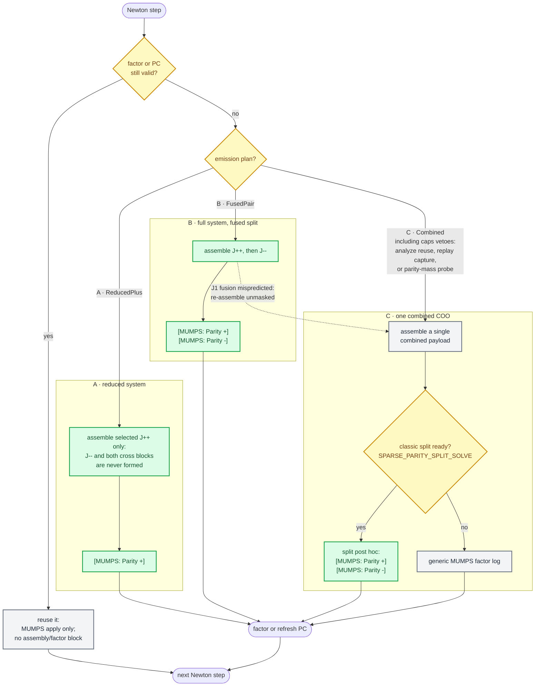

# Production Runtime Flags

Environment variables a user legitimately sets on a **production run** to tune
the solver, performance, or an evolution. Everything here is safe to leave at
its default; change it only with a reason.

This is the operator-facing catalog: the production-tunable flags only.
Debug/diagnostic gates and preprocessor tokens are deliberately omitted — see
the closing note.

> **Why not every uppercase name?** A grep finds hundreds, but most are not
> production env: ~35 are C-preprocessor / X-macro tokens (`KADATH_DECL_FN_*`,
> `KADATH_*_ENTRIES`, `KADATH_DEFINE_*`), and many are debug/diagnostic gates
> (`*_PROFILE`, `*_SELFTEST`, `*_PROBE`, `*_CENSUS`, `*_TRACE`, `*_CSV`, parked
> experiments). The real production surface is the ~35 below.

---

## Repeat-run BIN_BOOST seed staging

A completed BNS/BHNS run can supply the two converged `BIN_BOOST` star
solutions to an otherwise identical repeat. Copy both the `.toml` and `.dat`
for each star into the repeat run's
`$HOME_CELEPHAIS/data/convergence/` directory before launch. For the canonical
distance-35, equal-mass example, the required stems are:

```text
converged_NS_NOSYM_BIN_BOOST_35_0.0072111.dd2.1.35.0.3.z81.1266.0.13
converged_NS_NOSYM_BIN_BOOST_35_0.0072111.dd2.1.35.0.z0.0.13
```

Use seeds only from a completed run with the same physical inputs and grid.
The filename identity includes the binary separation and angular velocity plus
the star's EOS, mass, spin/tilt, shell layout, and resolution. The resume loader
also requires a compatible `.toml`/`.dat` pair; a lone file does not resume.

This is a repeat-run optimization only. Keep cold canonical runs unchanged, and
do not stage a converged BNS/BHNS pair when the binary solve is the workload
being measured. A successful repeat prints two `Solved previously:` lines whose
paths contain `BIN_BOOST`; absence of either line means the corresponding boost
stage ran normally.

---

## Spectral transform backend

| Flag | Default | What it tunes |
| --- | --- | --- |
| `CELEPHAIS_FFT_BACKEND` | `native` | Selects the cached real half-complex transform backend. Unset or `native` uses the production direct real-input codelets. `fftw` is accepted only by a build configured with `-DCELEPHAIS_ENABLE_FFTW_ORACLE=ON`; the default production build rejects it explicitly and has no FFTW header, symbol, or link dependency. All accepted transforms require even N=2..32 and reject invalid sizes before allocating transform state. The raw N=22..32 paths are independent of the fused line pipeline, which remains separately gated through N=20. See the [native FFT qualification contract](TESTING.md#native-fft-backend-qualification) and the current `HANDOFF.md` evidence before changing the build policy. |
| `CELEPHAIS_NATIVE_FUSED` | `1` | With the native backend, fuses strided consumption, CHEB/COSSIN or COS/SIN parity folding and packing, the selected codelet, and recurrence/extraction. Ordinary COSSIN uses fusion at N=6/8 on every supported platform. Linux/GCC/x86-64 additionally uses the plan-owned persistent route at N=10..16, with a cached-plan dispatcher for growing forward production batches; N=18/20 still uses the direct-real buffer route. Other compiler/platform combinations retain the buffer route at N=10..20. Inverse CHEB/CHEB_EVEN at N=18/20 also uses buffering. For the six COS/SIN parity families, fusion is retained for every direction through N=16, every N=18 forward route, N=18/20 odd-family inverse routes, and N=20 forward routes except COS/COS_EVEN. Set `0` to force the buffer-based native path as a rollback and same-backend A/B oracle. Ignored when the test-only FFTW oracle is selected. |

---

## A. Solver selection & MUMPS factor

| Flag | Default | What it tunes |
| --- | --- | --- |
| `CELEPHAIS_SOLVER` | `jfnk-mumps` | Newton backend: `jfnk-mumps` (matrix-free Jv + MUMPS right-PC), `mumps` (sparse direct), `dense` (ScaLAPACK). BNS `QUASI_EQUIL`, `FORCE_BALANCE`, and `ECC_RED` stages own the same JFNK-MUMPS default; any supported explicit value set here still wins. The boosted-NS handoff stage continues to force direct MUMPS when JFNK-MUMPS was selected. |
| `MUMPS_RANKS_PER_NODE` | unset (`max(floor(local ranks/4), 1)`) | Factor MUMPS on only the first N ranks of each node (a sub-communicator); assembly / `do_JX` / GMRES stay on all ranks. `0` uses all ranks and positive `N` selects a fixed count per node. The legacy string `auto` is treated like unset; it does not run a search. Fewer factor ranks usually reduce total MUMPS memory but can increase factor wall, while too many can become communication-bound. |
| `MUMPS_ORDERING` | `7` (auto → METIS) | MUMPS `ICNTL(7)` fill-reducing ordering, `0..7`. |
| `MUMPS_TREE_CACHE` | off | JFNK-MUMPS per-stage ordering cache. After the first successful preconditioner analyze, writes `converged_<solution-stem>.mumpstree` beside the solution outputs. A later refresh with an existing preconditioner replays the stored matching-composed column and symmetric permutations instead of rerunning METIS; the stored NNZ is provenance, not a pattern-identity requirement. An unreadable file, dimension mismatch, or composed analyze/factor/null-pivot failure is logged, removes the stale cache, and retries the ordinary fresh ordering path once without looping on replay. The cache is removed after the matching converged solution is written. Replay can change factor rounding, so bit-exactness is not claimed. Default off; set `1` (any value other than `0`/`false`/`off`/`no`) to enable saving and replaying. |
| `MUMPS_OOC` | `auto` | Exact tri-state for MUMPS factor storage (`ICNTL(22)`): `0` forces in-core, `1` forces out-of-core, and `auto` decides once after each successful JOB=1 and before JOB=2. Auto estimates resident factor memory per rank as `INFOG(16) / (1 + ICNTL(14)/100) × TOUCH`, multiplies by the actual factor ranks colocated with the MUMPS host rank, and enables OOC only when that node expectation is strictly greater than `node_available_memory_mb() × SAFETY`; it initializes ICNTL(22) off until this decision, an unreadable probe fails closed to in-core, and invalid tri-state values fall back to `auto`. The live node-memory probe is ratcheted to its process-lifetime minimum before `SAFETY`, so a transient high cannot re-admit in-core factorization after a lower reading. |
| `MUMPS_OOC_TOUCH` | `1.3` | Positive finite resident-memory multiplier used only by the automatic OOC decision. Invalid values fall back to `1.3`. |
| `MUMPS_OOC_SAFETY` | `0.7` | Positive finite multiplier applied to probed node-available memory for the automatic OOC budget. Invalid values fall back to `0.7`. |
| `MUMPS_OOC_BUDGET_MB` | unset | Test-only nonnegative override for the probed node-available memory in MB. The override is exact and neither uses nor updates the live-probe ratchet; `SAFETY` is still applied. Production leaves this unset and fails AUTO closed when the platform/cgroup probe is unreadable. |
| `MUMPS_OOC_TMPDIR` | `${HOME_CELEPHAIS}/data/ooc` | Directory MUMPS writes out-of-core factor files to (upstream env read). When a factorization runs OOC and this is unset, the solver sets it to the default and creates the directory; an explicit value always wins, and without `HOME_CELEPHAIS` the upstream scratch default stands. |
| `MUMPS_BLR` | `0` (off) | Block-low-rank compression level (`ICNTL(35)`). Lossy — degrades the preconditioner; use with care. |
| `MUMPS_BLR_DROP_TOL` | `0.0` | BLR drop tolerance (`CNTL(7)`); only when BLR ≠ 0. Must be finite, ≥ 0. |
| `DROP_TOL` | `1e-14` | Sparse-direct Jacobian drop scale. The first step retains the historical `scale × error^(1/4)` threshold (floored at `1e-16`); that derived value is then frozen for the nonlinear solve. |
| `SPARSE_CHORD_REUSE` | on | Sparse-direct chord Newton: engage only when the solve's initial residual is finite and strictly below the fixed `1e-3` entry threshold, then retain the latest factorization and reuse it for corrections while each accepted step reduces the residual by more than 10%. A rejected correction is rolled back exactly and refreshes the Jacobian; 64 consecutive chord steps also force a refresh. Disabled for the solve when sparse analyze reuse is requested. Set the exact value `0` to opt out; every other value is on. |
| `SPARSE_MUMPS_ANALYZE_REUSE` | off | Experimental sparse-direct mode: retain a low-threshold structural superset and reuse MUMPS symbolic analysis while numerical support remains contained. Production res7 testing found support growth even with a frozen threshold, so this remains opt-in. |
| `SPARSE_MUMPS_PATTERN_DROP_TOL` | `-1` (track the frozen numerical threshold) | Optional lower pattern threshold for analyze reuse. Nonnegative values are clamped no higher than the frozen numerical drop tolerance. |
| `SPARSE_MUMPS_SUPERSET_MAX_NNZ_RATIO` | `2` | Refuse analyze reuse when retained structural NNZ exceeds this multiple of the current numerical NNZ. |
| `DIRECT_REPLAY_CAPTURE` | empty (off) | Diagnostic-only exact sparse-direct MUMPS factor-input/RHS capture. Set a new path ending in `.kcsr`; existing destinations are never overwritten. Capture is unavailable on JFNK and refuses sparse analyze reuse. |
| `DIRECT_REPLAY_CAPTURE_ORDINAL` | `1` | Positive process-order candidate number to capture when a staged sparse-direct run assembles and factors more than one system. |
| `SPARSE_PARITY` | unset → legacy flags | Recommended single knob for the sparse parity permission ladder: exact values are `off`, `mask`, `split`, and `reduce`. An invalid value or an explicitly contradictory legacy alias is a startup error; an agreeing alias is harmless. |
| `SPARSE_PARITY_MASK` | on | Post-hoc y-parity mask on the assembled full Jacobian: sectors are graded from the first J (structural descriptors when complete, matrix mass otherwise) and the mask engages only when both sectors are square and the largest cross-sector entry is at roundoff (1e-12 of the largest entry) or within the fixed approximate allowance (1e-5). Prerequisite for the classic split and for fused emission; `JACOBIAN_PARITY_MASS` keeps all Jacobians full for its oracle. Set the exact value `0` to opt out; every other value is on. Alias rung of `SPARSE_PARITY`; scheduled for retirement after the fused-emission default-ON soak. |
| `SPARSE_SECTOR_REDUCE` | on | Certified invariant-sector Newton reduction for sparse-direct and JFNK-MUMPS. Before J1, every residual-row descriptor and Jacobian column must be gradable, the selected `+` block must be square, and the full entry residual must satisfy `forbidden_Linf <= max(1e-10 * active_Linf, 1e-12)`. Eligible solves assemble only the selected rows and columns from J1 onward: `J_{--}` and both cross blocks are never formed in the COO. MUMPS receives one `[MUMPS: Parity +]` block whether or not fused emission is enabled, except on direct analyze-reuse/replay-capture and centralized-COO diagnostic paths that require the legacy payload. JFNK also restricts its RHS, Krylov vectors, exact-Jv interface, and correction to the same `+` coordinates, while retaining the full nonlinear residual as the runtime symmetry oracle. Refusal falls back collectively to the full system; approximate-parity and malformed/non-square sectors stay masked-full. `JACOBIAN_PARITY_MASS` keeps all Jacobians full for its structural-versus-matrix oracle. Set the exact value `0` to opt out; every other value is on. Alias rung of `SPARSE_PARITY`; scheduled for retirement after the fused-emission default-ON soak. |
| `SPARSE_PARITY_SPLIT_SOLVE` | on via `celephais_runtime_env.sh`; bare solver off | Classic post-hoc option for factoring and solving a legacy combined block-diagonal COO as two y-parity sectors. Accepted fused direct/JFNK-MUMPS assembly no longer needs this flag: it emits independent `+` then `-` COO payloads and the shared MUMPS primitive consumes both automatically. An unmasked or verify-mode Jacobian keeps the single full-system solve, while malformed or non-square sector tables are refused. Direct Newton factors and solves two sectors transiently, so only one factor is resident and peak factor residency is the larger block; JFNK retains both sector factors. Sparse analyze reuse and direct replay capture retain the legacy combined-COO path. Alias rung of `SPARSE_PARITY`; scheduled for retirement after the fused-emission default-ON soak. |

| `SPARSE_PARITY` rung | Parity mask | Classic split | Sector reduction |
| --- | --- | --- | --- |
| `off` | off | off | off |
| `mask` | on | off | off |
| `split` | on | on | off |
| `reduce` | on | on | on |

When the umbrella is unset, `SPARSE_PARITY_MASK`,
`SPARSE_PARITY_SPLIT_SOLVE`, and `SPARSE_SECTOR_REDUCE` retain their existing
independent semantics. These legacy aliases are scheduled for retirement after
the fused-emission default-ON soak.

### Parity guard flow

The `SPARSE_PARITY` ladder grants permissions, while
`plan_jacobian_emission` makes one per-step decision about which system is
solved and which payload reaches MUMPS. The decision has three lanes, each with
its own log signature. Direct MUMPS and JFNK-MUMPS share the same one-line
system summary:

```text
Sector: <full|reduced>, Mask: <on|off> | System: <dof> (<nnz> nnz)
```

The reachable states are `full/off`, `full/on`, and `reduced/on`; reduction
requires the parity mask, so `reduced/off` cannot be emitted. A full masked
physical split is followed by `[MUMPS: Parity +]` and `[MUMPS: Parity -]`
blocks, while a reduced solve has only `[MUMPS: Parity +]`. A combined full
system has no parity block marker. JFNK-MUMPS appends its GMRES result and the
indented Eisenstat--Walker update to this shared MUMPS log.

The Jacobian line reports the slowest-rank wall time and the allocated storage
of the rank-0 COO index/value vector capacities. Physical parity-block storage
is summed, and decimal MB keeps the unit consistent with MUMPS:

```text
Jacobian build+gather: <seconds> s (COO: <MB> MB)
```

Each successful ordinary factor combines its slowest-rank phase timings,
policy, and post-factor MUMPS memory counters:

```text
MUMPS analyze+factorize: <analyze> + <factorize> s (<ordering>, OOC <on|off>, <MB> MB used, <MB> MB allocated)
```

`used` is MUMPS `INFOG(21)`, the effective factor memory on the factor rank
that used the most. `allocated` is `INFOG(18)`, the MUMPS allocation on the
factor rank that allocated the most. Neither is process RSS, and neither is the
`INFOG(16)` analysis estimate. Physical parity blocks report the same merged
line as `analyze+factorize:` inside their `[MUMPS: Parity +]` and
`[MUMPS: Parity -]` blocks. These compact build and factor lines are normal
user-facing output and do not require `CELEPHAIS_TIMING`. The automatic-OOC
budget calculation and detailed ordering/fill statistics are no longer printed
in the normal runtime log. Applying an existing factor uses the compact
slowest-rank timing `MUMPS apply: <seconds> s`; JFNK aggregates all MUMPS
preconditioner applications made by the GMRES callback. A sparse-direct
chord-reuse step emits the same compact timing for its retained-factor solve.
The rare JFNK invalid-GMRES fallback solve that constructs a correction after
the Krylov run is outside the callback aggregate.



| Lane | Entered when | Factored |
| --- | --- | --- |
| **A** | the ladder (or legacy alias) permits reduction, its certificate and per-step residual/drift gates hold, and the builder returns `ReducedPlus` | one `J_{++}` |
| **B** | the ladder (or legacy alias) permits masking, fused emission is ready with verify and local COO blocks off, and the builder returns `FusedPair` | `J_{++}`, then `J_{--}` |
| **C** | the builder returns `Combined`, including any caps veto; a permitted classic split may still factor the combined payload by sector | one combined system, or two sector solves under the classic split |

The physical-payload guard rejects `JACOBIAN_PARITY_MASS` and centralized COO
diagnostics; direct MUMPS additionally keeps analyze reuse and replay capture on
the legacy payload. A selected `J_{++}` payload does not depend on
`JACOBIAN_FUSED_PARITY_MASK` or its verify mode.

## B. Newton / JFNK convergence

| Flag | Default | What it tunes |
| --- | --- | --- |
| `JFNK_MAX_ITERS` | `64` (`48` in launcher) | Max GMRES iterations per Newton linear correction. |
| `JFNK_RTOL` | `1e-8` | Fixed GMRES relative tolerance (used only when Eisenstat-Walker is off). |
| `JFNK_MUMPS_PC_REFRESH` | `10` | Newton-step cadence for rebuilding the MUMPS right preconditioner (lag). |
| `JFNK_MUMPS_PC_ADAPTIVE` / `_MAX_STEPS` | off / `20` | Opt-in cost-aware extension of the fixed PC cadence. Reuse past the fixed cadence only when the preceding accepted step reduced the nonlinear residual by at least 20% and a quadratic Krylov-depth cost projection is cheaper than the measured build+factor wall. Poor progress, missing measurements, unusable GMRES, or the hard maximum refreshes; an unusable deferred correction is retried with a fresh PC before state mutation. A maximum below the fixed cadence is normalized to that cadence. |
| `JFNK_EW` | on | Eisenstat-Walker adaptive forcing term (choice 2). `0` falls back to `JFNK_RTOL`. |
| `JFNK_EW_GAMMA` / `_ALPHA` / `_MAX` / `_MIN` | `0.9` / `2.0` / `1e-3` / `=RTOL` | E-W tunables: `gamma·(‖F_k‖/‖F_{k-1}‖)^alpha`, clamped to `[min, max]`. |
| `JFNK_LINESEARCH` | on | Guarded backtracking line search; rejects a step that increases `‖F‖`. `0` disables. |
| `JFNK_LS_ARMIJO` / `_ALPHA` / `_MAX_BACKTRACK` / `_MIN_LAMBDA` | off / `1e-4` / `3` / `0.1` | Line-search acceptance + damping controls. |
| `JFNK_STEP_SCALE` | `1` | Scales the accepted Newton step. |

Launcher placement is deliberately explicit rather than guessed. On Linux
Open MPI runs, `MPI_BIND_TO` and `MPI_MAP_BY` are passed to
`--bind-to` and `--map-by`; under Slurm, `SLURM_CPU_BIND` is passed to
`srun --cpu-bind`. They are unset by default because placement policy depends
on the allocation topology. Open MPI processor binding is unsupported on
macOS, and the launcher rejects an explicit binding request there.

## C. Performance (default **ON** — set `0` only to bisect a regression)

`DO_JX_MPI`, `SEC_MEMBER_MPI`, `DO_JX_TERM_CLOSURE`,
`RESIDUAL_FORWARD`, `VAL_DOMAIN_DER_ABS_CACHE`,
`DO_JX_DER_ABS_CACHE`,
`JACOBIAN_STRUCTURAL_PLAN_CACHE`,
`SPARSE_PARITY_MASK`,
`JACOBIAN_WLANE2` / `WLANE4` / `WLANE8` / `WLANE16` / `WLANE32`,
`JACOBIAN_VARDOM_WLANE2`,
`MATCHING_LANE_EXPORT`, `MATCHING_IMPORT_LANE_BATCH`, and
`DERIVATIVE_LANE_TILING`, `OPE_DER_BATCH`,
`OPE1D_WORKSPACE`, and `OPE_ACTION_WRITE_INTO`

All except `SPARSE_PARITY_MASK` are bit-exact optimizations protected by
self-tests; leave them on. Each falls back to its unoptimized path when set to
`0`.
`JACOBIAN_STRUCTURAL_PLAN_CACHE` retains the direct-singleton plan and
column metadata on each `System_of_eqs`; an exact topology, tensor-layout, and
spectral-basis comparison prevents reuse after a structural or basis change.
Assembler profiling reports cache checks, miss builds, and hit/miss counts.
`JACOBIAN_VARDOM_WLANE2` is the compatibility-named master gate for
adapted-geometry lane packing; `JACOBIAN_VARDOM_MAX_WIDTH` selects the
largest width the normal `32→16→8→4→2` fallback cascade may try.
`OPE_ACTION_WRITE_INTO` reuses compatible persistent `Term_eq` result
storage; set it to `0` to ablate the optimization or to retain the legacy
deep-assignment path on a workload that has not passed parity testing.
`SPARSE_PARITY_MASK` is the deliberate non-bit-exact exception: it drops
measured cross-sector Jacobian entries at exact parity (`X < 1e-12`) or at the
owner-approved fixed approximate-parity allowance (`1e-12 <= X <= 1e-5`).
Unsupported spaces and larger coupling self-disable without masking. Set the
exact value `0` to opt out; every other value is on.
The derivative flags tile lane preparation, batch compatible 1-D operations,
and reuse a bounded traversal workspace; any one may be set to `0` for its
legacy path. `OPE_DER_AOSOA` is a separate default-off data-layout
experiment.

The following Jacobian-assembly experiments remain default-off or conservatively
capped. Keep their aggressive settings off on an unvalidated workload until
canonical COO-bit-hash, RSS, and convergence A/B gates have passed.

| Flag | What it changes |
| --- | --- |
| `OPE_DER_AOSOA` | Uses coefficient-major, lane-contiguous derivative kernels. Requires `DERIVATIVE_LANE_TILING=1`, `OPE_DER_BATCH=1`, and `OPE1D_WORKSPACE=1`. |
| `JACOBIAN_GLOBAL_GROUP_PLAN` | Forms the W-lane cascade globally and assigns complete groups to MPI ranks with a deterministic cost heuristic. |
| `JACOBIAN_VARDOM_MAX_WIDTH` | Caps adapted-geometry packing at `2`, `4`, `8`, `16`, or `32` (default `2`). Intermediate values act as a cap. Unsupported spaces and metrics fall back. |
| `JACOBIAN_LOCAL_COO_BLOCKS` | Stores rank-local COO entries in fixed-capacity append-only blocks before the MPI gather. |
| `JACOBIAN_FUSED_PARITY_MASK` | Skips cross-sector entries at emission instead of compacting them after assembly. Direct and JFNK-MUMPS gather accepted full-system fused output into independent sector-local COO payloads: ordered `[MUMPS: Parity +]`, `[MUMPS: Parity -]` blocks. Pre-J1 selection is independent: when it selects `J_{++}`, only the `+` block is assembled and logged even when this flag is off. On the first full Jacobian of a stage, fusion is optimistic when complete square structural labels exist pre-assembly; the emitted statistics certify the decision afterwards. Certification accepts up to the approximate-engage tolerance (1e-5), while a ratio at or above it logs `J1 fusion: mispredicted` and retries unmasked. Later full refreshes require an exact certified decision. Default **on** since 2026-08-07 (proof arms: zero fused-attributable defects, direct r13 QE + JFNK res7; set the exact value `0` to opt out during the soak — the flag is scheduled for retirement afterwards). Local-COO-block and centralized-COO diagnostic paths self-disable physical full-system fused output. `JACOBIAN_FUSED_PARITY_VERIFY=1` keeps full-system emission unmasked while cross-checking every entry's fused verdict (validation); it does not suppress a pre-J1-selected `+` payload. `JACOBIAN_FUSED_PARITY_J1_TOLERANCE` overrides the certification tolerance (diagnostic, e.g. `1e-30` forces the mispredict path). |

Everything not listed here (`*_PROFILE`, `*_SELFTEST`, `*_PROBE`, `*_CENSUS`,
`*_TRACE`, `*_CSV`, `ERROR_INIT_BREAKDOWN*`, `MUMPS_NATIVE_VERBOSE`,
`MUMPS_INFOG_TRACE`, the `*_ORACLE` /
`ROW_DISJOINT_*` / `SCHUR_PROBE_*` diagnostics, and the `KADATH_DECL/ENUM/DEFINE_*`
macro tokens) is **debug/diagnostic or not an env var at all** — not for
production use.
